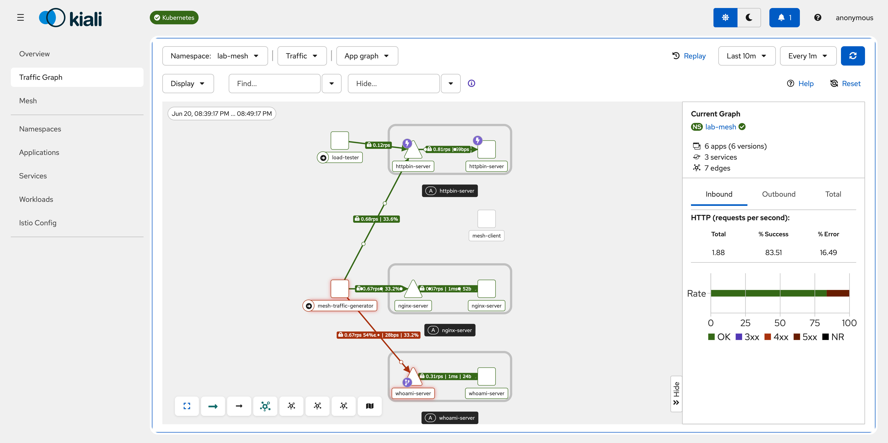

# kind-istio-mtls-lab

## What this is

This is a small local learning lab for understanding Istio mTLS with kind.

This is a personal proof of concept for my own learning on a local machine. It is not
an official Istio tutorial, supported distribution, or production template.

The official Istio documentation teaches [mTLS migration](https://istio.io/latest/docs/tasks/security/authentication/mtls-migration/),
[fault injection](https://istio.io/latest/docs/tasks/traffic-management/fault-injection/),
and [circuit breaking](https://istio.io/latest/docs/tasks/traffic-management/circuit-breaking/)
as focused tasks. This lab does not replace them. Its added value is one
start-to-finish workshop: create a single local cluster, install Istio, compare
mesh and non-mesh traffic, observe it, inject faults, and trip a circuit breaker.

It uses:

- a local kind cluster
- Istio sidecar mode
- Kiali, Prometheus, and Grafana
- a mesh namespace with injected sidecars
- an external namespace without injected sidecars
- simple HTTP workloads for traffic, failure injection, and circuit breaking

The lab is designed to show:

- how Istio sidecar injection works
- how workloads communicate inside a service mesh
- how mTLS behaves in `PERMISSIVE` and `STRICT` mode
- how traffic appears in Kiali
- what changes when traffic comes from outside the mesh
- how Istio fault injection and circuit breaking look in practice

## What this is not

- not production-ready
- not a secure-by-default production config
- not a reference architecture
- not meant for cloud deployment

## Naming

The lab uses role-based names so each object explains what it does.

| Name | Purpose |
| --- | --- |
| `lab-mesh` | Namespace with Istio sidecar injection enabled |
| `lab-external` | Namespace without sidecar injection |
| `mesh-client` | In-mesh curl client used for tests |
| `external-client` | Out-of-mesh curl client used for mTLS checks |
| `httpbin-server` | HTTP test server |
| `nginx-server` | Simple web server |
| `whoami-server` | Simple identity/debug server |
| `mesh-traffic-generator` | Continuous in-mesh request generator |
| `load-tester` | Fortio load tester for circuit breaker tests |

## Concepts

**Service mesh**: Infrastructure that handles service-to-service traffic, security, telemetry, and policy without putting that logic in each app.

**Sidecar**: A helper container that runs next to the application container in the same pod.

**istio-proxy**: Istio's Envoy sidecar container. It intercepts pod traffic and applies mesh behavior such as mTLS and telemetry.

**mTLS**: Mutual TLS. Both sides of a connection prove identity with certificates and encrypt traffic.

**PeerAuthentication**: Istio policy that controls whether workloads accept plaintext traffic, mTLS traffic, or require mTLS.

**PERMISSIVE mode**: Workloads accept both plaintext and mTLS traffic. This is useful for learning and migration.

**STRICT mode**: Workloads require mTLS. Clients without an Istio sidecar and mesh identity should fail to connect normally.

**Kiali**: A web UI that shows Istio service mesh topology, traffic, health, and configuration.

**Prometheus**: Metrics storage used by Kiali to build useful traffic graphs and service metrics.

## Prerequisites

The lab intentionally uses a small, fixed compatibility set:

| Component | Version |
| --- | --- |
| Docker | 29.x |
| kind | 0.27.0 |
| Kubernetes node | 1.32.2, pinned by image digest |
| kubectl | 1.32.x |
| Istio / istioctl | 1.30.1 |

Other versions may work but are not supported by this POC. Istio 1.30 supports
Kubernetes 1.32 through 1.36; this lab pins the oldest supported minor to keep
the environment reproducible.

## Phase 1: Create the kind cluster

```sh
./scripts/00-bootstrap-cluster.sh
```

## Phase 2: Install Istio

```sh
./scripts/01-install-istio.sh
```

This lab uses the Istio demo profile because it is convenient for learning. It is not production-ready.

## Phase 3: Install observability tools

```sh
./scripts/02-install-observability.sh
```

This installs Prometheus, Grafana, and Kiali.

The script first tries to find addon manifests under the local Istio installation. If it cannot find them, it downloads matching sample manifests from GitHub based on the local `istioctl` client version.

If you want to force local manifests, set `ISTIO_DIR`:

```sh
ISTIO_DIR=/path/to/istio ./scripts/02-install-observability.sh
```

## Phase 4: Deploy workloads

```sh
./scripts/03-deploy-workloads.sh
```

This creates:

- `lab-mesh`
- `lab-external`
- `mesh-client`
- `external-client`
- `httpbin-server`
- `nginx-server`
- `whoami-server`

## Phase 5: Verify sidecar injection

```sh
kubectl get pods -n lab-mesh
```

```sh
kubectl get pods -n lab-mesh -o jsonpath='{range .items[*]}{.metadata.name}{"\t"}{.spec.containers[*].name}{"\n"}{end}'
```

Pods in `lab-mesh` should contain two containers:

- the application container, such as `mesh-client`, `httpbin-server`, `nginx-server`, or `whoami-server`
- the `istio-proxy` sidecar container

The `istio-proxy` container appears because the `lab-mesh` namespace has `istio-injection=enabled`.

The `external-client` pod in `lab-external` should not have an `istio-proxy` sidecar.

## Phase 6: Test mTLS PERMISSIVE

Run the mode-aware test. The script applies the policy and verifies it:

```sh
./scripts/04-test-mtls-mode.sh permissive
```

Expected behavior:

- `mesh-client` to `httpbin-server` works
- `external-client` to `httpbin-server` works because plaintext is accepted

## Phase 7: Test mTLS STRICT

Run the mode-aware test. It first proves that the external request works in
`PERMISSIVE`, then applies `STRICT` and requires the expected connection reset:

```sh
./scripts/04-test-mtls-mode.sh strict
```

Expected behavior:

- in-mesh traffic works because both sides have Istio sidecars and mesh identity
- external plaintext traffic fails because the external client has no Istio sidecar and no mesh identity
- the script reports that external failure as `PASS`

## Phase 8: Generate traffic for Kiali

Open Kiali:

```sh
istioctl dashboard kiali
```

Start continuous in-mesh traffic:

```sh
./scripts/05-start-mesh-traffic.sh
```

The traffic generator continuously calls:

- `http://httpbin-server:8000/get`
- `http://nginx-server`
- `http://whoami-server`



Check logs:

```sh
kubectl logs -n lab-mesh deploy/mesh-traffic-generator -c mesh-traffic-generator -f
```

Stop traffic:

```sh
./scripts/06-stop-mesh-traffic.sh
```

## Phase 9: Inject failures

Enable fault injection for `whoami-server`:

```sh
./scripts/07-enable-whoami-faults.sh
```

This applies an Istio `VirtualService` that returns HTTP `503` for about 50% of requests to `whoami-server`.

Keep the traffic generator running, then check Kiali:

- open `Graph`
- select namespace `lab-mesh`
- use a recent time range, such as last 5 minutes
- look for failed traffic on the edge from `mesh-traffic-generator` to `whoami-server`

Disable fault injection:

```sh
./scripts/08-disable-whoami-faults.sh
```

## Phase 10: Test circuit breaking

Enable an aggressive `DestinationRule` for `httpbin-server`:

```sh
./scripts/09-enable-httpbin-circuit-breaker.sh
```

Run concurrent load from the in-mesh `load-tester`:

```sh
./scripts/10-test-httpbin-circuit-breaker.sh
```

The script first requires a baseline of 60 successful requests without the
circuit breaker. It then enables the rule and requires both successful `200`
responses and circuit-breaker `503` responses:

- at least one request succeeds
- at least one request fails fast with HTTP `503`
- Kiali should show failed traffic on the edge from `load-tester` to `httpbin-server`

Disable the circuit breaker:

```sh
./scripts/11-disable-httpbin-circuit-breaker.sh
```

## Phase 11: Cleanup

Cleanup asks for confirmation before deleting the kind cluster:

```sh
./scripts/99-cleanup.sh
```

For non-interactive cleanup:

```sh
./scripts/99-cleanup.sh --yes
```

## Validation commands

```sh
kubectl get pods -n lab-mesh
```

```sh
kubectl get pods -n lab-external
```

```sh
kubectl get peerauthentication -n lab-mesh
```

```sh
kubectl describe peerauthentication -n lab-mesh
```

```sh
istioctl proxy-status
```

```sh
kubectl get pods -n istio-system
```

```sh
kubectl get svc -n istio-system
```

```sh
kubectl logs -n lab-mesh deploy/mesh-client -c istio-proxy
```

```sh
kubectl get virtualservice -n lab-mesh
```

```sh
kubectl get destinationrule -n lab-mesh
```

## Operational hygiene included

The manifests include basic learning-lab hygiene:

- common `app.kubernetes.io/*` labels
- CPU and memory requests
- CPU and memory limits
- readiness probes
- liveness probes
- explicit cleanup confirmation

These settings are intentionally small because this is a local kind lab.
